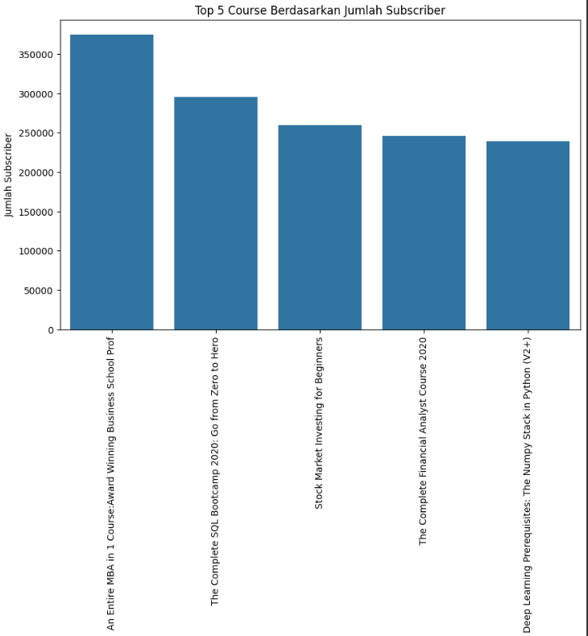
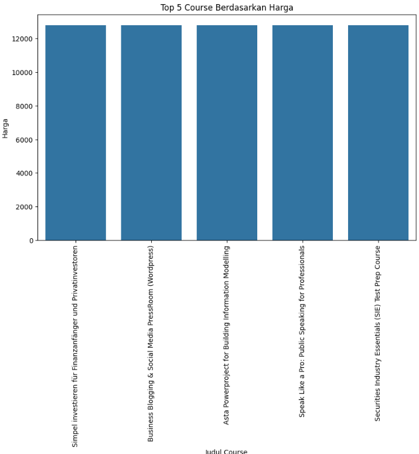
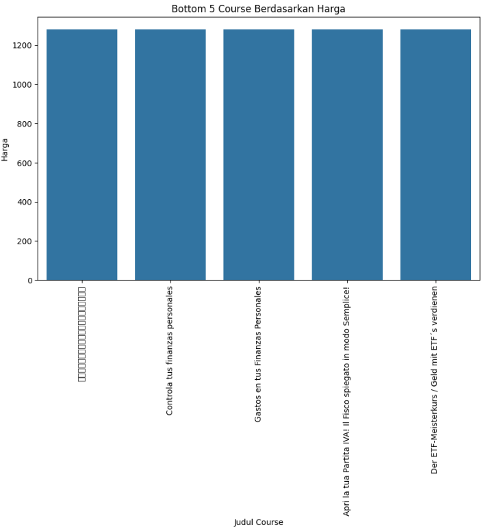
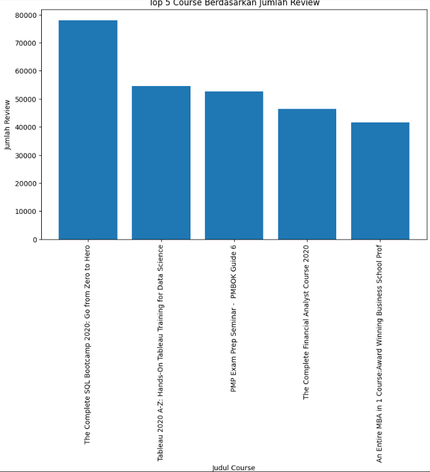

# Laporan Proyek Machine Learning - Bagas Aqmal Febrianto

## Project Overview

Perkembangan teknologi informasi telah membawa perubahan signifikan dalam dunia pendidikan, khususnya melalui platform pembelajaran daring seperti Udemy yang menyediakan berbagai kursus online. Namun, jumlah kursus yang banyak dan beragam seringkali membuat pengguna mengalami kesulitan dalam memilih kursus yang paling sesuai dengan kebutuhan dan preferensi mereka.

Untuk mengatasi permasalahan tersebut, sistem rekomendasi berbasis content-based filtering menjadi solusi yang tepat. Sistem ini menggunakan informasi konten dari kursus, seperti judul, rating, dan harga, untuk memberikan rekomendasi yang relevan kepada pengguna tanpa perlu data interaksi yang kompleks. Penggunaan teknik TF-IDF dan pengolahan fitur numerik seperti rating serta harga membantu meningkatkan akurasi dalam pemilihan kursus.

Beberapa penelitian di Indonesia menunjukkan efektivitas sistem rekomendasi content-based filtering untuk platform e-learning. Rahman dkk. (2021) menjelaskan bahwa penggunaan TF-IDF dan cosine similarity mampu meningkatkan kualitas rekomendasi pada e-learning. Dewi dan Prasetyo (2019) juga menyatakan bahwa pendekatan content-based filtering memberikan hasil rekomendasi yang sesuai dengan preferensi pengguna di platform pembelajaran daring. Selain itu, Suryani (2020) menekankan pentingnya penggabungan fitur teks dan numerik untuk menghasilkan rekomendasi yang lebih optimal, khususnya dalam konteks pembelajaran daring yang semakin kompleks.

Dengan menggunakan dataset Udemy, proyek ini bertujuan membangun sistem rekomendasi kursus yang membantu pengguna menemukan kursus sesuai kebutuhan secara cepat dan efisien, sekaligus meningkatkan kepuasan pengguna terhadap platform pembelajaran daring.

## Business Understanding

### Problem Statements

Menjelaskan pernyataan masalah:
- Pengguna mengalami kesulitan dalam memilih kursus yang sesuai di platform Udemy karena banyaknya pilihan yang tersedia.

- Tidak adanya sistem rekomendasi yang dapat membantu pengguna menemukan kursus yang relevan dengan preferensi mereka secara cepat dan akurat.

- Informasi seperti rating dan harga kursus belum dimanfaatkan secara optimal dalam memberikan rekomendasi yang sesuai kebutuhan pengguna.

### Goals

Menjelaskan tujuan proyek yang menjawab pernyataan masalah:
- Membangun sistem rekomendasi kursus berbasis content-based filtering yang memanfaatkan fitur judul, rating, dan harga untuk membantu pengguna menemukan kursus yang sesuai.

- Mengembangkan model yang dapat memproses data teks (judul kursus) dan fitur numerik (rating dan harga) untuk menghasilkan rekomendasi yang lebih akurat.

- Menyediakan rekomendasi yang dapat meningkatkan kepuasan pengguna dan efisiensi pencarian kursus di platform Udemy.

### Solution statements
1. Solution 1: Hybrid Filtering dengan Penggabungan Fitur Numerik
Menggabungkan fitur teks dari judul kursus dengan fitur numerik seperti rating dan harga. Fitur numerik distandarisasi menggunakan MinMaxScaler dan dikonversi menjadi matriks sparse. Selanjutnya, matriks fitur teks dan numerik digabungkan untuk menghitung cosine similarity. Pendekatan ini diharapkan menghasilkan rekomendasi yang mempertimbangkan kualitas dan harga kursus.

2. Solution 2:  Content-Based Filtering dengan TF-IDF dan Cosine Similarity
Menggunakan teknik TF-IDF untuk mengekstraksi fitur dari judul kursus, kemudian menghitung kemiripan antar kursus dengan cosine similarity. Sistem merekomendasikan kursus yang paling mirip berdasarkan judul.

## Data Understanding

Berikut ini adalah informasi dari dataset yang digunakan.

Tabel 1. Informasi Dataset

|   |   |
|---|---|
|__Nama dataset__| Finance & Accounting Courses - Udemy (13K+ course)|
|__Deskripsi dataset__| Dataset yang digunakan dalam proyek ini merupakan himpunan data dari berbagai kursus yang tersedia di platform Udemy, dengan fokus pada kategori Development. Dataset ini mencakup sekitar 13.000 kursus yang tersebar dalam berbagai subtopik, seperti Finance, Accounting, Blockchain, Cryptocurrency, Economics, dan bidang terkait lainnya. Setiap entri dalam dataset memuat informasi penting seperti judul kursus, status berbayar atau gratis, jumlah subscriber, rating rata-rata, jumlah ulasan, harga asli, harga diskon, serta waktu pembuatan dan publikasi kursus. |
|__Jumlah jenis data__| 20 |
|__Jumlah Baris Data__| 13608 |
|__Link download__| https://www.kaggle.com/datasets/jilkothari/finance-accounting-courses-udemy-13k-course |

## Exploratory Data Analysis

### 1. Deskripsi Variabel

Berikut ini adalah variabel yang ada pada Dataset : 

| No | Kolom                          | Tipe Data   | Non-Null | Deskripsi                                                                 |
|----|--------------------------------|-------------|----------|---------------------------------------------------------------------------|
| 1  | `id`                           | `int64`     | 13608    | ID unik untuk setiap kursus.                                              |
| 2  | `title`                        | `object`    | 13608    | Judul kursus.                                                             |
| 3  | `url`                          | `object`    | 13608    | Link URL menuju halaman kursus di situs Udemy.                           |
| 4  | `is_paid`                      | `bool`      | 13608    | Menunjukkan apakah kursus tersebut berbayar (`True`) atau gratis (`False`). |
| 5  | `num_subscribers`             | `int64`     | 13608    | Jumlah pengguna yang telah berlangganan kursus tersebut.                 |
| 6  | `avg_rating`                  | `float64`   | 13608    | Rata-rata rating keseluruhan kursus.                                     |
| 7  | `avg_rating_recent`          | `float64`   | 13608    | Rata-rata rating terbaru (recent) yang diterima kursus.                  |
| 8  | `rating`                      | `float64`   | 13608    | Nilai rating keseluruhan berdasarkan sistem penilaian Udemy.            |
| 9  | `num_reviews`                | `int64`     | 13608    | Jumlah ulasan yang diberikan oleh pengguna terhadap kursus.             |
| 10 | `is_wishlisted`              | `bool`      | 13608    | Apakah kursus dimasukkan ke dalam daftar keinginan oleh pengguna.        |
| 11 | `num_published_lectures`     | `int64`     | 13608    | Jumlah video atau materi pembelajaran yang telah dipublikasikan.         |
| 12 | `num_published_practice_tests` | `int64`   | 13608    | Jumlah tes latihan yang tersedia dalam kursus.                           |
| 13 | `created`                    | `object`    | 13608    | Tanggal pembuatan kursus.                                                |
| 14 | `published_time`             | `object`    | 13608    | Waktu kursus pertama kali dipublikasikan.                                |
| 15 | `discount_price__amount`     | `float64`   | 12205    | Harga kursus setelah diskon (jika ada).                                  |
| 16 | `discount_price__currency`   | `object`    | 12205    | Mata uang harga diskon.                                                  |
| 17 | `discount_price__price_string` | `object`  | 12205    | Representasi string dari harga diskon.                                   |
| 18 | `price_detail__amount`       | `float64`   | 13111    | Harga asli kursus sebelum diskon.                                        |
| 19 | `price_detail__currency`     | `object`    | 13111    | Mata uang harga asli.                                                    |
| 20 | `price_detail__price_string` | `object`    | 13111    | Representasi string dari harga asli.                                     |

### 2. Pemeriksaan missing value

| Kolom                          | Jumlah Null |
|--------------------------------|-------------|
| `discount_price__amount`       | 1403        |
| `discount_price__currency`     | 1403        |
| `discount_price__price_string` | 1403        |
| `price_detail__amount`         | 497         |
| `price_detail__currency`       | 497         |
| `price_detail__price_string`   | 497         |

Tabel diatas adalah kolom yang terdeteksi memiliki nilai null. Tampak bahwa terdapat beberapa fitur yang memiliki nilai null atau kosong.

**Pemeriksaan Kolom Rating**

| Rating  | Jumlah Kursus |
|---------|----------------|
| 0.0     | 563            |
| 5.0     | 273            |
| 4.0     | 58             |
| 3.0     | 45             |
| 3.5     | 40             |

Jika diperhatikan kolom rating memiliki nilai antara 0 - 5. Data yang memiliki rating 0 dapat dikatakan bahwa course tersebut belum pernah dilakukan pembelian sehingga belum ada yang memiliki rating. 

### Multivariate

Berdasarkan visualisasi diatas, didapatkan bahwa course terbanyak berdasarkan jumlah subscribernya adalah course dengan judul "An Entire MBA in 1 Course:Award Winning Busineness School Prof".

Berdasarkan visualisasi diatas, tampak bahwa course dengan harga tertinggi berada pada course dngan judul "Simpel investieren für Finanzanfänger und Priv..." dan course dengan jumlah harga 12.800 lainnya.

Sedangkan course dengan harga terendah, dalah course dengan harga 1280. Contohnya seperti " 株式投資テクニカル入門「超初心者コース"

Course dengan jumlah review terbanyak ditempati oleh course dengan judul The Complete SQL Bootcamp 2020: Go from Zero t..." dengan total reivew sebesar 78006.

## Data Preparation

### Pembersihan Data

Pemberishan data dilakukan dengan beberapa skema, antara lain : 

**1. Menangani Missing Value**

Data yang diketahui memiliki nilai null pada pemeriksaan sebelumnya, akan dilakukan penghapusan. Dapat dilihat pada tabel berikut hasil dari pembersihan missing value.

| Kolom                          | Missing Value |
|-------------------------------|----------------|
| id                            | 0              |
| title                         | 0              |
| url                           | 0              |
| is_paid                       | 0              |
| num_subscribers               | 0              |
| avg_rating                    | 0              |
| avg_rating_recent             | 0              |
| rating                        | 0              |
| num_reviews                   | 0              |
| is_wishlisted                 | 0              |
| num_published_lectures        | 0              |
| num_published_practice_tests | 0              |
| created                       | 0              |
| published_time                | 0              |
| discount_price__amount        | 0              |
| discount_price__currency      | 0              |
| discount_price__price_string  | 0              |
| price_detail__amount          | 0              |
| price_detail__currency        | 0              |
| price_detail__price_string    | 0              |

**2. Pembersihan pada kolom Rating**

Data yang memiliki rating 0 dapat dikatakan bahwa course belum pernah dilakukan pembelian, Maka dari itu kita akan mengambil nilai rating yang >=1.

| Rating   | Jumlah (Count) |
|----------|----------------|
| 5.00000  | 273            |
| 4.00000  | 58             |
| 3.00000  | 45             |
| 3.50000  | 40             |
| 4.50000  | 38             |
| ...      | ...            |
| 3.23317  | 1              |
| 4.31781  | 1              |
| 3.98656  | 1              |
| 3.64913  | 1              |
| 3.95716  | 1              |

### Feature Engineering

Pembuatan kolom bahasa ini dilakukan untuk nantinya melakukan filtering terhadap course yang akan digunakan, dengan kata lain. Course yang digunakan adalah course yang berbahasa inggris.

Pembuatan kolom bahasa ini memanfaatkan library langdetect untuk mendeteksi bahasa pada fitur title nantinya.

| No  | Judul Kursus                                                                       | Bahasa |
|-----|-------------------------------------------------------------------------------------|--------|
| 2   | PMP Exam Prep Seminar - PMBOK Guide 6                                              | pt     |
| 7   | Beginner to Pro in Excel: Financial Modeling and Valuation                        | it     |
| 11  | Business Analysis Fundamentals                                                     | de     |
| 24  | Beginning Project Management: Project Management Level I                          | nl     |
| 27  | Agile Fundamentals: Including Scrum and Kanban                                     | de     |
| 29  | Sales Training: Practical Sales Techniques                                         | fr     |
| 34  | Email Etiquette: Write More Effective Emails at Work                              | fr     |
| 45  | Six Sigma White Belt                                                               | de     |
| 47  | Fundamentals of Analyzing Real Estate Investments                                  | ca     |
| 70  | Data Analysis Essentials Using Excel                                               | ca     |

### Seleksi Fitur

Pada bagian ini kita akan melakukan seleksi fitur yang digunakan. Pemilihan fitur didasarkan pada konsep Content-Based Filtering, di mana rekomendasi diberikan berdasarkan kemiripan konten atau atribut dari item (dalam hal ini, kursus), bukan berdasarkan perilaku pengguna lain.

| Fitur                  | Deskripsi                                                                                          |
|------------------------|----------------------------------------------------------------------------------------------------|
| `id`                   | Identifikasi unik untuk setiap kursus.                                                             |
| `title`                | Representasi konten utama kursus dalam bentuk teks, digunakan untuk menghitung kemiripan (TF-IDF). |
| `rating`               | Indikator kualitas berdasarkan penilaian pengguna, digunakan untuk preferensi dalam rekomendasi.   |
| `price_detail__amount` | Representasi nilai ekonomi kursus, digunakan untuk menyesuaikan rekomendasi berdasarkan harga.      |
| `language`             | Digunakan sebagai filter agar hanya kursus berbahasa Inggris yang dianalisis.                      |

Selanjutnya kita akan melakukan filter terhadap data yang sudah dipilih berdasarkan fitur sebelumnya. Dimana hal ini dilakukan aagar kita berfokus pada course yang menggunakan bahasa inggris.

| No | Kolom                 | Non-Null Count | Tipe Data |
|----|-----------------------|----------------|-----------|
| 0  | `id`                  | 9738           | int64     |
| 1  | `title`               | 9738           | object    |
| 2  | `rating`              | 9738           | float64   |
| 3  | `price_detail__amount`| 9738           | float64   |
| 4  | `language`            | 9738           | object    |

Tampak bahwa data yang bersih dan siap digunakan saat ini berjumlah 9738 baris dan 5 kolom. Namun perlu diketahui untuk kolom **language nantinya tidak akan digunakan**. Karena kolom tersebut hanya digunakan untuk melakukan filtering di tahap sebelumnya.

### Filter Data Berdasarkan Bahasa

Selanjutnya kita akan melakukan filter terhadap data yang sudah dipilih berdasarkan fitur Bahasa. Dimana hal ini dilakukan aagar kita berfokus pada course yang menggunakan bahasa inggris.

| Kondisi Data         | Jumlah |
|----------------------|--------|
| Sebelum Filter       | 11.640 |
| Setelah Filter       | 9.761  |

Tampak bahwa data yang bersih dan siap digunakan saat ini berjumlah 9761 baris dan 5 kolom. Namun perlu diketahui untuk kolom language nantinya tidak akan digunakan. Karena kolom tersebut hanya digunakan untuk melakukan filtering di tahap sebelumnya.

### Bersihkan judul dari spasi/tanda baca

Tahap ini dilakukan pembersihan sepasi dan tanda baca pada fitur title, dilakukan agar mengurangi kesalahan pada proses rekomendasi sebelum masuk ke tahap TFIDF

### TF-IDF
Sebelum membangun sistem rekomendasi berbasis konten, diperlukan transformasi data teks (judul kursus) menjadi bentuk numerik agar dapat dihitung kemiripannya. Oleh karena itu, dilakukan proses ekstraksi fitur teks menggunakan TF-IDF (Term Frequency-Inverse Document Frequency) pada fitur title. Dalam hal ini stop_words juga digunakan untuk menghilangkan kata-kata umum dalam bahasa inggris.

### Standarisasi fitur numerik
Selain fitur berbasis teks, kita juga memanfaatkan fitur numerik seperti rata-rata rating (avg_rating) dan harga kursus (price_detail__amount) untuk meningkatkan kualitas rekomendasi. Namun, karena skala nilai dari masing-masing fitur bisa sangat berbeda (misalnya, rating berkisar antara 0–5, sedangkan harga bisa mencapai ratusan dolar), maka perlu dilakukan proses normalisasi agar kedua fitur memiliki skala yang sebanding.

Pada tahap ini digunakan metode Min-Max Scaling untuk mengubah nilai dari setiap fitur ke dalam rentang 0 hingga 1. Tujuannya adalah agar tidak ada fitur yang mendominasi hasil perhitungan karena perbedaan skala yang besar.

### Gabungkan Fitur hasil TF-IDF dengan Fitur Numerik

Penggabungan ini dilakukan karena kita menerapkan pendekatan Content-Based Filtering berbasis hybrid, di mana sistem rekomendasi tidak hanya mempertimbangkan kemiripan dari judul kursus, tetapi juga memperhitungkan aspek kuantitatif seperti rating dan harga kursus.

Agar data numerik bisa digabungkan dengan data TF-IDF (berbentuk sparse matrix), maka fitur numerik yang telah dinormalisasi terlebih dahulu diubah menjadi sparse matrix menggunakan csr_matrix. Kemudian, kita gabungkan kedua matrix menggunakan fungsi hstack() dari SciPy.

## Modeling and Results

### Pendekatan 1 : Hybrid Filtering

**Hybrid Filtering (Content-Based + Rating Weighting)**

Menggabungkan content-based filtering dengan bobot tambahan dari kolom rating dan price_detail__amount. Dalam pendekatan ini, hasil dari cosine similarity dimodifikasi agar mempertimbangkan rating dan harga.

Kelebihan :
- Menghasilkan rekomendasi yang tidak hanya mirip secara konten, tetapi juga berkualitas tinggi (rating).

- Dapat disesuaikan dengan preferensi pengguna (misal: harga murah atau rating tinggi).

- Lebih informatif dalam pengambilan keputusan.

Kekurangan :
- Lebih kompleks dalam implementasi.

- Perlu normalisasi data numerik agar bobot adil.

- Tidak cocok jika sebagian besar data rating atau price kosong.

#### Cosine Similirity

Langkah selanjutnya adalah menghitung kemiripan antar kursus menggunakan Cosine Similarity.

|           | Item 1  | Item 2  | Item 3  | ...     | Item n-1 | Item n  |
|-----------|---------|---------|---------|---------|----------|---------|
| **Item 1**| 1.000   | 0.604   | 0.665   | ...     | 0.542    | 0.423   |
| **Item 2**| 0.604   | 1.000   | 0.611   | ...     | 0.538    | 0.467   |
| **Item 3**| 0.665   | 0.611   | 1.000   | ...     | 0.534    | 0.412   |
| ...       | ...     | ...     | ...     | ...     | ...      | ...     |
| **Item n-1**| 0.542 | 0.538   | 0.534   | ...     | 1.000    | 0.478   |
| **Item n**| 0.423   | 0.467   | 0.412   | ...     | 0.478    | 1.000   |

Nilai hasil cosine similarity berada di antara 0 dan 1, di mana nilai 1 berarti sangat mirip dan 0 berarti tidak mirip sama sekali.

| Title                                                                 | Learn to Trade Using Technical Analysis | Qpon Bootcamp - Extreme Couponing for Beginners! | Diagnosis Evolution: The ICD-9 to ICD-10 Transition | The Business of Video and Photography | Create and Launch Your Podcast Website with WordPress |
|----------------------------------------------------------------------|----------------------------------------|--------------------------------------------------|-----------------------------------------------------|----------------------------------------|----------------------------------------------------------|
| 3 Low Cost Business Tips by America's #1 Wine Brand Founders        | 0.364522                               | 0.304973                                         | 0.393339                                            | 0.397099                               | 0.411656                                                 |
| Modeling Workflow Patterns in TIBCO Business Studio                 | 0.339454                               | 0.305845                                         | 0.349135                                            | 0.337112                               | 0.380987                                                 |
| Minutes of a Meeting Basic Intro Course                             | 0.297514                               | 0.268057                                         | 0.305999                                            | 0.269197                               | 0.333915                                                 |
| Learn the Basics About Saving, Investing & Managing Credit          | 0.461575                               | 0.354971                                         | 0.411229                                            | 0.365292                               | 0.446408                                                 |
| Amazon Affiliate Marketing Using Authority Site (Beginners)         | 0.444978                               | 0.303001                                         | 0.427493                                            | 0.453012                               | 0.415412                                                 |
| Government Contracting for Everyone                                 | 0.405698                               | 0.317435                                         | 0.455034                                            | 0.454552                               | 0.460531                                                 |
| How to Read P&ID, PFD & BFD Used in Process Plant Like Pro          | 0.400283                               | 0.295660                                         | 0.462732                                            | 0.480380                               | 0.456278                                                 |
| Digital Strategy & Transformation for Business Executives           | 0.359496                               | 0.323902                                         | 0.369749                                            | 0.361443                               | 0.403481                                                 |
| The Secret of a Successful Strategy                                 | 0.211321                               | 0.190398                                         | 0.217348                                            | 0.191208                               | 0.237177                                                 |
| Applied Unsupervised Learning with Python (Bitcoin Trading)         | 0.382841                               | 0.278337                                         | 0.446057                                            | 0.467525                               | 0.436877                                                 |

Dataframe diatas adalah salah satu matriks kesamaan antar course. Semakin mendekati angka 1 maka course dapat dikatakan memiliki kesamaan yang tinggi. Sebagai contoh, Course "how i used networking to triple my business in 6 months" memiliki kesamaan 54% dengan "drop shipping 2.0 (more traffic & less competition)"

#### Hasil Top-N Rekomendasi

| No | Judul Kursus                                      | Similarity |
|----|--------------------------------------------------|------------|
| 1  | the ultimate hands-on hadoop - tame your big data! | 0.9362     |
| 2  | big data and hadoop for beginners - with hands-on! | 0.8550     |
| 3  | taming big data with mapreduce and hadoop - hands on! | 0.7175     |
| 4  | hands-on pyspark for big data analysis            | 0.7009     |
| 5  | business analytics with big data : a complete guide | 0.6460     |

Tampak bahwa pada percobaan diatas, ketika dimasukan judul sebuah course, didapatkan 5 rekomendasi dari yang tertinggi.

Input : "Big Data and Hadoop for Beginners - with Hands-on!"

Rekomendasi tertinggi : "The Ultimate Hands-On Hadoop - Tame your Big Data!"

dengan kesamaan 93%

## Pendekatan Umum (Cosine + TFIDF)

**Content-Based Filtering (TF-IDF + Cosine Similarity)**

Pendekatan ini menggunakan judul kursus (title) untuk menghitung kemiripan antar kursus berdasarkan teks menggunakan TF-IDF dan cosine similarity. Rekomendasi diberikan berdasarkan kemiripan konten.

Kelebihan:
- Tidak memerlukan data pengguna.

- Bisa merekomendasikan kursus baru selama judul tersedia.

- Relevan secara tematik karena berbasis konten.

Kekurangan:
- Tidak mempertimbangkan rating atau popularitas kursus.

- Kemiripan terbatas hanya pada teks, bisa menimbulkan bias jika judul kursus ambigu atau terlalu umum.

- Tidak bisa mengenali kursus yang bagus tapi dengan judul yang berbeda secara semantik.

| Title                                                        | become a great presenter and increase your influence | the project management course: beginner to project manager | protect your creative works with us copyright registration | beginners guide to creating your own wordpress web shop | introduction to the actuarial exams |
|--------------------------------------------------------------|------------------------------------------------------|------------------------------------------------------------|-------------------------------------------------------------|----------------------------------------------------------|------------------------------------|
| investing 101: asset classes                                  | 0.000000                                             | 0.000000                                                   | 0.0                                                         | 0.000000                                                | 0.0                                |
| how to overcome the fear of starting your own business       | 0.000000                                             | 0.000000                                                   | 0.0                                                         | 0.000000                                                | 0.0                                |
| primavera p6: oracle primavera project scheduling training   | 0.000000                                             | 0.148322                                                   | 0.0                                                         | 0.000000                                                | 0.0                                |
| from complete beginner to consistent forex professional.     | 0.000000                                             | 0.165524                                                   | 0.0                                                         | 0.000000                                                | 0.0                                |
| use linkedin to find investors                               | 0.000000                                             | 0.000000                                                   | 0.0                                                         | 0.000000                                                | 0.0                                |
| dropshipping basics: the beginner's guide to amazon fba       | 0.000000                                             | 0.160361                                                   | 0.0                                                         | 0.085962                                                | 0.0                                |
| compare project management software 2019                      | 0.000000                                             | 0.308269                                                   | 0.0                                                         | 0.000000                                                | 0.0                                |
| start and run a successful consulting business                | 0.000000                                             | 0.000000                                                   | 0.0                                                         | 0.000000                                                | 0.0                                |
| consulting fees guide: how to increase your consulting fees   | 0.118754                                             | 0.000000                                                   | 0.0                                                         | 0.044514                                                | 0.0                                |
| create your online membership program                         | 0.000000                                             | 0.000000                                                   | 0.0                                                         | 0.000000                                                | 0.0                                |

Dengan menggunakan pendekatan yang sama seperti sebelumnya namun dengan fitur yang berbeda, terlihat bahwa nilai cosine similarity yang dihasilkan cenderung rendah dan mendekati nol. Hal ini menunjukkan bahwa tingkat kemiripan antar data sulit dibedakan, sehingga menghasilkan rekomendasi yang kurang akurat atau tidak relevan.

#### Hasil Top N Rekomendasi

| Judul                                               | Skor Similaritas      |
|----------------------------------------------------|-----------------------|
| hands-on hadoop masterclass - tame the big data!   | 0.7474471550412047    |
| the ultimate hands-on hadoop - tame your big data! | 0.7438557334573       |
| taming big data with mapreduce and hadoop - hands on! | 0.6715521429058737 |
| hands-on pyspark for big data analysis              | 0.5421546337539548    |
| fundamentals of data analysis for big data           | 0.46915882287592925   |

Tampak bahwa pada percobaan diatas, ketika dimasukan judul sebuah course, didapatkan 5 rekomendasi dari yang tertinggi.

Input : "Big Data and Hadoop for Beginners - with Hands-on!"

Rekomendasi tertinggi : "hands-on hadoop masterclass - tame the big data!"

dengan kesamaan 74%

## Evaluasi

Pada tahap ini akan dilakukan evaluasi terhadap Kedua Pendekatan tersebut. Kita akan menggunakan rating sebagai proxy relevansi, dmna :
1. Kursus dianggap relevan jika rating >= 4.0

2. Kursus dianggap tidak relevan jika rating < 4.0

Langkah-Langkah :
1. Ambil rekomendasi dari fungsi yang sudha dibuat sebelumnya.
2. Tentukan relevansi dari hasil rekomendasi berdasarkan rating.
3. Hitung matrik evaluasi : Precision, Recall, F1, NDCG

### Evaluasi Pendeketan Hybrid

| Metric    | Value  |
|-----------|--------|
| Precision | 0.8    |
| Recall    | 0.001  |
| F1 Score  | 0.001  |
| NDCG      | 0.983  |

| No | Judul Rekomendasi                                      | Similarity | Relevansi |
|----|--------------------------------------------------------|------------|-----------|
| 1  | the ultimate hands-on hadoop - tame your big data!     | 0.9362     | 1         |
| 2  | big data and hadoop for beginners - with hands-on!     | 0.8550     | 1         |
| 3  | taming big data with mapreduce and hadoop - hands on!  | 0.7175     | 1         |
| 4  | hands-on pyspark for big data analysis                  | 0.7009     | 0         |
| 5  | business analytics with big data : a complete guide     | 0.6460     | 1         |

Berdasarkan hasil rekomendasi, dapat dijelaskan sebagai berikut :
- Precision 0.8 = Dari 5 rekomendasi yang diberikan, 80% (yaitu 4 dari 5) memiliki rating tinggi (≥ 4.0).
- Recall: 0.001 = Dari seluruh kursus dengan rating ≥ 4.0 di dataset (df_new), hanya 0.1% yang berhasil direkomendasikan.
- F1-score: 0.001 = Skor gabungan antara precision dan recall juga rendah karena recall-nya sangat rendah, meskipun precision-nya bagus.
- NDCG (Normalized Discounted Cumulative Gain): 0.983 = Urutan rekomendasi sangat baik. Judul-judul yang relevan (bernilai tinggi) muncul di urutan atas daftar rekomendasi.

Relevansi: [1, 1, 1, 0, 1]

Empat dari lima rekomendasi (baris ke-0, 1, 2, dan 4) punya rating ≥ 4.0, ditandai dengan angka 1 pada Relevansi.

Hanya satu yang tidak relevan (0 → baris ke-3: "hands-on pyspark...").

### Evaluasi Pendekatan Umum

| Metric    | Value |
|-----------|-------|
| Precision | 1.0   |
| Recall    | 0.001 |
| F1 Score  | 0.002 |
| NDCG      | 1.0   |

| No | Judul Rekomendasi                                               | Similarity | Relevansi |
|----|------------------------------------------------------------------|------------|-----------|
| 1  | the ultimate hands-on hadoop - tame your big data!              | 0.9145     | 1         |
| 2  | big data and hadoop for beginners - with hands-on!              | 0.7474     | 1         |
| 3  | taming big data with mapreduce and hadoop - hands on!           | 0.5623     | 1         |
| 4  | hands-on pyspark for big data analysis                          | 0.4539     | 1         |
| 5  | fundamentals of data analysis for big data                      | 0.3928     | 1         |

Berdasarkan hasil rekomendasi, dapat dijelaskan sebagai berikut :
- Precision 1 = Dari 5 rekomendasi yang diberikan, 100% (yaitu 5 dari 5) memiliki rating tinggi (≥ 4.0).
- Recall: 0.001 = Dari seluruh kursus dengan rating ≥ 4.0 di dataset (df_new), hanya 0.1% yang berhasil direkomendasikan.
- F1-score: 0.002 = Skor gabungan antara precision dan recall juga rendah karena recall-nya sangat rendah, meskipun precision-nya bagus.
- NDCG (Normalized Discounted Cumulative Gain): 1 = Urutan rekomendasi sangat baik. Judul-judul yang relevan (bernilai tinggi) muncul di urutan atas daftar rekomendasi.

Relevansi: [1, 1, 1, 1, 1]

lima rekomendasi (baris ke-0, 1, 2, dan 4) punya rating ≥ 4.0, ditandai dengan angka 1 pada Relevansi.

# Referensi

Rahman, A., Santosa, P. I., & Wijaya, T. (2021). Sistem rekomendasi e-learning menggunakan content-based filtering dengan TF-IDF dan cosine similarity. Jurnal Teknologi Informasi dan Multimedia, 10(2), 98-107.

Dewi, L. K., & Prasetyo, D. (2019). Pengembangan sistem rekomendasi pada platform e-learning berbasis content-based filtering. Jurnal Sistem Informasi, 15(1), 45-53.

Suryani, A. (2020). Optimalisasi sistem rekomendasi belajar daring dengan penggabungan fitur numerik dan teks. Seminar Nasional Informatika dan Sistem Informasi, 4(1), 210-217.
